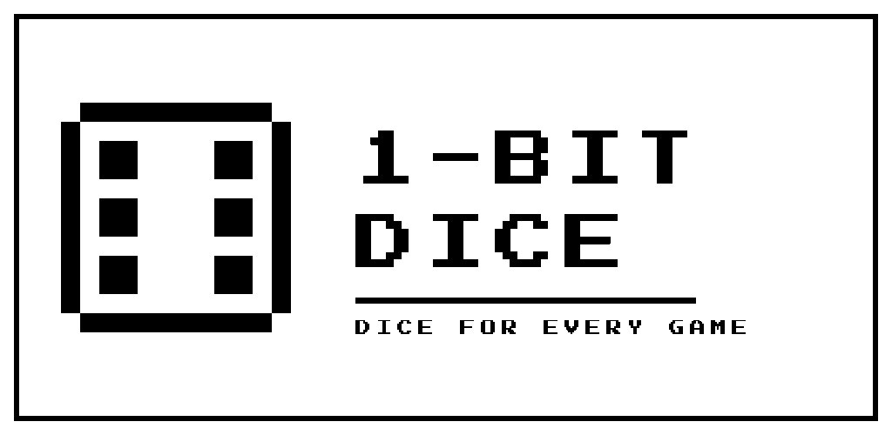
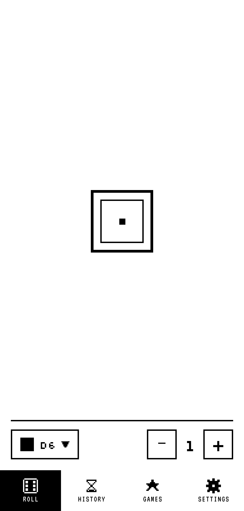
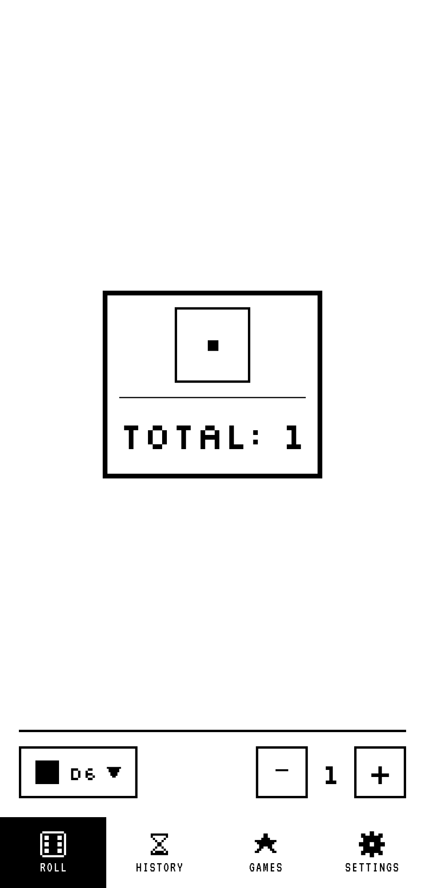
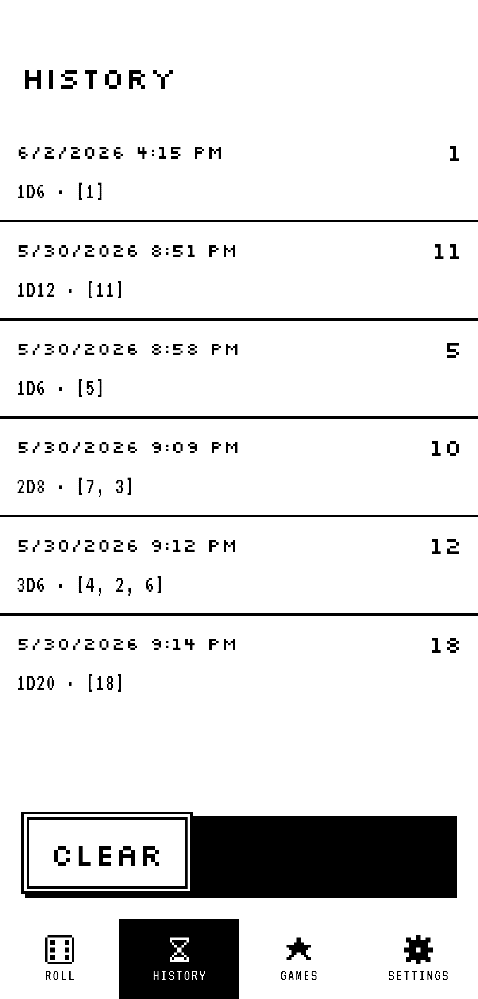
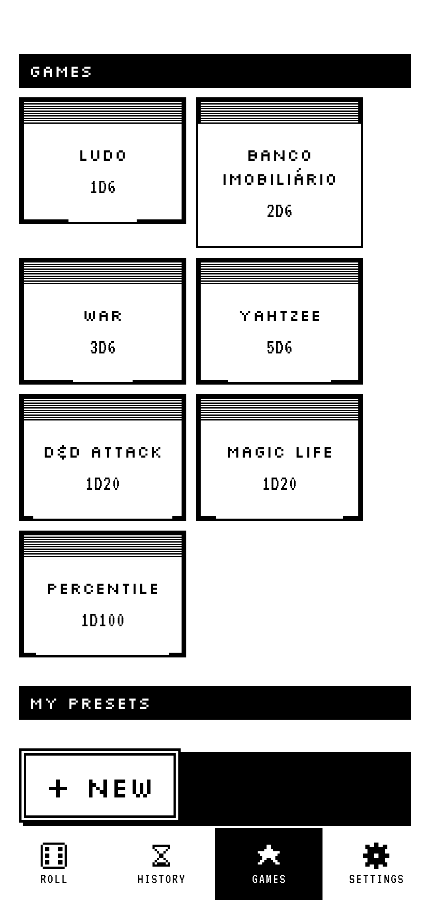
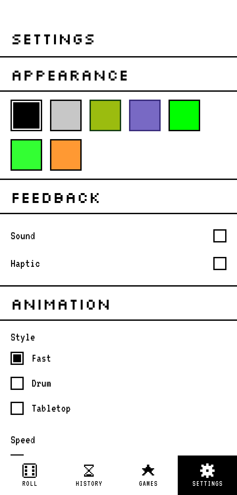

<div align="center">



# 1-Bit Dice

**Roll the dice. Keep it pixel.**

A retro dice roller for board games and tabletop RPGs, built around a strict
1-bit aesthetic — two colors, sharp pixels, zero clutter.
No accounts, no ads, fully offline.

<br>

<a href="https://play.google.com/store/apps/details?id=com.am2.onebitdice">
  
</a>

<br>

[](https://github.com/4rthurmonteiro/onebit-dice/actions/workflows/ci.yml)
[](https://flutter.dev)
[](https://dart.dev)
[](#quality-gates)
[](https://pub.dev/packages/very_good_analysis)
[](LICENSE)

</div>

---

## Screenshots

<div align="center">

| Roll | Dice picker | History | Games | Settings |
|:---:|:---:|:---:|:---:|:---:|
|  |  |  |  |  |

<sub>Captured on a real device in profile mode by an `integration_test` harness — see
[`integration_test/store_screenshots_test.dart`](integration_test/store_screenshots_test.dart).</sub>

</div>

---

## Features

- **Any die, any pool** — D4, D6, D8, D10, D12, D20 and D100, one at a time or a
  fistful at once, with the running total and the full equation.
- **Roll history** — every roll is persisted locally, so "what did you get?"
  never needs a re-roll.
- **Game presets** — built-in setups for popular games, plus your own saved dice
  pools, one tap away.
- **Seven 1-bit palettes** — from Mac Classic to Game Boy DMG.
- **Sound and haptics** — crunchy 1-bit roll SFX and tactile feedback, both
  independently toggleable.
- **Adjustable animation** — three roll styles (fast, drum, tabletop), each at
  three speeds.
- **10 languages** — the UI follows your device locale.
- **Offline and private** — nothing personal leaves the device.

---

## The palette rule

Every theme is exactly **two colors** — `ink` (foreground) and `paper`
(background). No gradients, no shadows, no anti-aliasing, no intermediate tones.
That constraint is enforced by the theme layer, not by convention.

| Palette | Ink | Paper |
|---|---|---|
| Mac Classic |  `#000000` |  `#FFFFFF` |
| Mac Beige |  `#000000` |  `#C7C7C7` |
| Game Boy DMG |  `#0F380F` |  `#9BBC0F` |
| Commodore 64 |  `#352879` |  `#7869C4` |
| ZX Spectrum |  `#000000` |  `#00FF00` |
| Apple II Green |  `#000000` |  `#33FF33` |
| Apple //e Amber |  `#000000` |  `#FF9933` |

---

## Tech stack

| Concern | Choice |
|---|---|
| Framework | Flutter (stable), Dart `^3.12.0` |
| State | `setState` + `ChangeNotifier`, `provider` for DI only — no Bloc, no Riverpod |
| Navigation | `go_router` + `StatefulShellRoute` (typed routes via `go_router_builder`) |
| Local storage | `hive_ce` (history, presets) + `shared_preferences` (settings) |
| Audio | `flutter_soloud` |
| Telemetry | Firebase Analytics + Crashlytics |
| i18n | `flutter_localizations` + `intl` ARB files |
| Lints | `very_good_analysis` |
| Testing | `flutter_test`, `mocktail`, `fake_async`, `integration_test` |

Deliberately **not** used: no dependency injection framework, no code-gen for
state, no third-party design system. The 1-bit look is hand-built from
`CustomPainter`s and primitive widgets.

---

## Architecture

A flat, feature-sliced layout. `core/` holds app-wide services, `features/` owns
one folder per screen, `shared/` is what more than one feature reuses.

```
lib/
├── core/                 # App-wide services
│   ├── analytics/        # AnalyticsService interface + Firebase impl
│   ├── audio/            # AudioController, SoLoud sound player
│   ├── haptic/           # HapticController
│   ├── i18n/             # Supported locales, LocaleController, l10n extension
│   ├── models/           # DiceType, RollResult
│   ├── storage/          # Hive init, repositories, typed preferences
│   └── theme/            # Palette, ThemeProvider, typography, ThemeExtension
├── features/
│   ├── dice/             # Roll screen, controller, dice animations
│   ├── history/          # Roll log
│   ├── presets/          # Built-in + custom dice pools
│   ├── settings/         # Palette, language, sound, haptics, animation
│   ├── shell/            # Bottom-nav shell
│   └── splash/
├── shared/
│   ├── utils/            # Secure-random dice rolling
│   └── widgets/          # MacButton, MacWindow, PixelDivider, HatchPainter…
└── l10n/                 # Generated localizations
```

Every service sits behind an interface (`AnalyticsService`, `HistoryRepository`,
`PalettePreference`, …) with an in-memory fake for tests — which is what makes
the 100% coverage gate practical rather than painful.

---

## Quality gates

Both gates run on every push and pull request via
[`.github/workflows/ci.yml`](.github/workflows/ci.yml), and must pass before any
commit lands:

```bash
flutter analyze --fatal-infos   # zero issues, very_good_analysis ruleset
flutter test --coverage         # all tests pass at 100% line coverage
```

Coverage is enforced at **100%** by
[`very_good_coverage`](https://github.com/VeryGoodOpenSource/very_good_coverage).
Only `lib/main.dart` (entry point), generated `*.g.dart` files and generated
localizations are excluded.

**84** source files, **64** test files.

---

## Getting started

```bash
# Prerequisites: Flutter 3.44+ on the stable channel
flutter --version

git clone https://github.com/4rthurmonteiro/onebit-dice.git
cd onebit-dice

flutter pub get
dart run build_runner build --delete-conflicting-outputs   # Hive + go_router
flutter run
```

> **Firebase.** The committed `google-services.json`, `GoogleService-Info.plist`
> and `firebase_options.dart` point at the production project. These hold only
> Firebase's public client identifiers — safe to commit by design — and the app
> uses Analytics and Crashlytics only, with no Auth, Firestore or Storage. To
> point the app at your own project, run `flutterfire configure`.

### Useful commands

```bash
flutter test --coverage                     # unit + widget tests
flutter test test/features/dice             # a single slice
flutter build appbundle --release           # Play Store bundle
flutter build apk --release --split-per-abi # installable APKs
```

---

## Localization

Shipping in **10 languages**: Portuguese (BR), English, German, Spanish, French,
Italian, Japanese, Korean, Russian and Simplified Chinese.

Strings live in ARB files under `lib/l10n/`; Portuguese (BR) is the source of
truth and English is the fallback for any unsupported device locale. The Play
Store listing is translated for 11 locales under
[`android/fastlane/metadata/android/`](android/fastlane/metadata/android).

---

## Releases

Signed builds are produced and distributed by a single script, used identically
on a developer machine and in CI:

```bash
tools/release/distribute.sh --bump patch --groups qa --notes "release notes"
```

It bumps the semantic version, builds a signed APK and ships it to Firebase App
Distribution. Play Store uploads go through Fastlane:

```bash
cd android
bundle exec fastlane internal     # internal testing track
bundle exec fastlane production   # production, staged rollout
bundle exec fastlane metadata     # store listing only, all locales
```

Signing keys and service-account credentials are never committed — locally they
come from `android/key.properties`, in CI from GitHub Secrets.

---

## Credits

Built by **AM2 Studio**.

Fonts are OFL-licensed: [Silkscreen](https://github.com/googlefonts/Silkscreen),
[VT323](https://github.com/googlefonts/VT323) and
[Press Start 2P](https://github.com/googlefonts/PressStart2P).

Google Play and the Google Play logo are trademarks of Google LLC.

## License

Released under the [MIT License](LICENSE).
