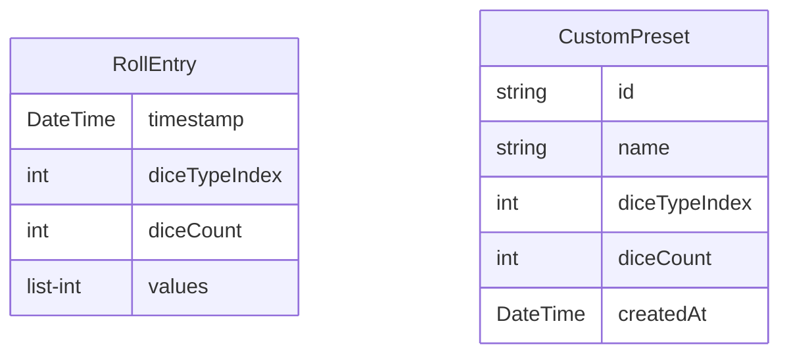

# feat: e04 storage layer — Standard

## Overview

Entrega a camada de persistência local do 1-Bit Dice: cinco interfaces de storage por domínio (paleta, configurações de app, última configuração de dado, histórico de rolagens, presets customizados), com implementações in-memory para testes/dev e implementações concretas backed por [`shared_preferences`](https://pub.dev/packages/shared_preferences) e [`hive_ce`](https://pub.dev/packages/hive_ce) (fork community-maintained do Hive). Inclui o módulo `HiveInit` que abre as boxes — chamado pelo splash screen (E06) como gate de inicialização, não no `main()`.

Esta epic não toca UI nem features ainda. Ela entrega o "chão" que as próximas epics consomem: `DiceController` (E05) restaurando última config + persistindo cada `RollResult` como `RollEntry`, `HistoryScreen` (E06) listando entradas, `PresetsScreen` (E07) gerenciando até 10 presets customizados, e `SettingsScreen` (E08) trocando paleta/som/haptic/animação.

O brainstorm ([2026-05-25-e04-storage-layer-brainstorm-doc.md](../brainstorm/2026-05-25-e04-storage-layer-brainstorm-doc.md)) capturou todas as decisões arquiteturais (interfaces por domínio, `hive_ce` over Hive 2.x, splash como gate de init, schema completo do `RollEntry`, `typeId` allocation). Este plano transforma essas decisões em um checklist file-by-file com cobertura 100%.

## Problem Statement / Motivation

Hoje o app:

- Tem `PalettePreference` interface ([lib/core/theme/palette_preference.dart](../../lib/core/theme/palette_preference.dart)) com apenas `InMemoryPalettePreference` — paleta escolhida pelo usuário é perdida ao fechar o app.
- Tem `RollResult` ([lib/core/models/roll_result.dart](../../lib/core/models/roll_result.dart)) como modelo de domínio, mas não há onde persistir cada rolagem para alimentar o histórico (E06).
- Não tem onde persistir presets customizados (até 10 slots por usuário, requisito de E07).
- Não tem onde persistir toggles de som/haptic, estilo/velocidade de animação ou a última configuração de dado/quantidade — requisitos de E05 e E08.

Sem E04, as features de E05–E08 não podem fechar. E04 é o desbloqueio mais barato e isolado: zero UI, zero state-management novo, apenas Dart + duas dependências (`shared_preferences`, `hive_ce`).

A escolha de `hive_ce` (community edition) sobre `hive` 2.x clássico evita dívida técnica futura: o Hive original está sem releases significativos desde 2023 e o autor migrou para Isar (que está em transição para v4). `hive_ce` é drop-in replacement, mesma API, mesmos `typeId`s, ativamente mantido.

## Proposed Solution

Cinco interfaces de storage por domínio, cada uma com impl in-memory + impl concreta. Splash screen (E06) será o gate de init das boxes Hive.

```
lib/core/
├── theme/
│   └── palette_preference.dart       # add SharedPreferencesPalettePreference
└── storage/
    ├── app_settings_preference.dart  # interface + InMemory + SharedPrefs impl
    ├── last_dice_config_preference.dart  # interface + InMemory + SharedPrefs impl
    ├── history_repository.dart       # interface + InMemory + Hive impl
    ├── presets_repository.dart       # interface + InMemory + Hive impl (cap 10)
    ├── hive_init.dart                # bootstrap: open boxes, register adapters
    └── models/
        ├── animation_settings.dart   # AnimationStyle + AnimationSpeed enums (pure)
        ├── roll_entry.dart           # @HiveType(typeId: 0)
        ├── roll_entry.g.dart         # generated
        ├── custom_preset.dart        # @HiveType(typeId: 1)
        └── custom_preset.g.dart      # generated

test/core/
├── theme/
│   └── palette_preference_test.dart  # extend with SharedPrefs tests
└── storage/
    ├── app_settings_preference_test.dart
    ├── last_dice_config_preference_test.dart
    ├── history_repository_test.dart
    ├── presets_repository_test.dart
    ├── hive_init_test.dart
    └── models/
        ├── animation_settings_test.dart
        ├── roll_entry_test.dart
        └── custom_preset_test.dart
```

### Domain split

| Interface | Stored data | Backend | Read | Write |
|---|---|---|---|---|
| `PalettePreference` (existente) | `PaletteId?` | SharedPreferences | sync | async |
| `AppSettingsPreference` | sound on/off, haptic on/off, `AnimationStyle`, `AnimationSpeed` | SharedPreferences | sync | async |
| `LastDiceConfigPreference` | last `DiceType`, last `count` (1..10) | SharedPreferences | sync | async |
| `HistoryRepository` | `List<RollEntry>` (append-only) | Hive box `roll_history` | sync (snapshot) + `Stream<List<RollEntry>>` | async append/clear |
| `PresetsRepository` | `List<CustomPreset>` (até 10) | Hive box `custom_presets` | sync (snapshot) + `Stream<List<CustomPreset>>` | async add/remove/rename |

### `RollResult` vs `RollEntry`

`RollResult` (E03) é o **modelo de domínio** — imutável, value-equal via `Equatable`, sem dependência de Hive. `RollEntry` é a **entidade de storage** — mesma forma de dados, mas com annotations `@HiveType` / `@HiveField` e suporte a geração de adapter. Conversão acontece no `HistoryRepository`:

```dart
// HistoryRepository.append:
final entry = RollEntry.fromResult(result);
await _box.add(entry);

// HistoryRepository.snapshot:
return _box.values.map((e) => e.toResult()).toList(growable: false);
```

Essa separação mantém `core/models/` livre de dependências de persistência e permite que `RollEntry` evolua sem quebrar consumidores de `RollResult`.

### ERD (Hive models)



Sem foreign keys — presets não referenciam entries do histórico; histórico não conhece presets.

### Splash como gate de init

O `main()` permanece minimalista. `HiveInit.init()` é chamado dentro do `SplashScreen` (E06) via `FutureBuilder` ou `initState` + `setState`. Detalhes ficam em E06; **este plano apenas expõe `HiveInit.init()` como API pública**, deixando comentado no doc que o consumidor é E06.

## Technical Considerations

- **Arquitetura**: segue o padrão estabelecido por `PalettePreference` — `abstract interface class` + `InMemory<Name>` no mesmo arquivo. Implementações concretas (SharedPreferences ou Hive) ficam **no mesmo arquivo** quando não há dependência circular; quando há (impl Hive precisa importar o adapter gerado), o arquivo cresce mas ainda fica coeso. Não criar pastas `impl/` ou prefixos `_real_`.
- **`PalettePreference` evolution**: o arquivo existente ganha `SharedPreferencesPalettePreference` lado a lado com `InMemoryPalettePreference`. Nenhuma mudança em `ThemeProvider` — só a wiring lá no `main.dart` / `app.dart` muda em E06 quando trocarmos `InMemoryPalettePreference()` por `SharedPreferencesPalettePreference(prefs)`.
- **`AnimationSettings` lives in storage models, not in dice models**: `AnimationStyle` (`fast`, `drum`, `tabletop`) e `AnimationSpeed` (`fast`, `medium`, `slow`) são consumidos pela UI de settings (E08) e pelo widget de dado (E12). Ainda assim, ficam em `lib/core/storage/models/` porque são primariamente **valores persistidos** — segue o paradigma de manter modelos próximos do que os define. Mover para `lib/core/models/` se E12 começar a tê-los como parte do contrato de domínio.
- **Schema completo do `RollEntry`** (locked pelo brainstorm): `timestamp` (`DateTime`), `diceTypeIndex` (`int`, persiste `DiceType.index`), `diceCount` (`int`), `values` (`List<int>`). Total e equation são derivados via `toResult()` que rehidrata o `RollResult`. Persistir índices em vez de strings/enum-name evita migração ao renomear membros do enum no futuro — mas exige cuidado: **não reordenar `DiceType` sem release de migração**. Documentar no doc-comment de `DiceType`.
- **`typeId` allocation** (locked pelo brainstorm): `RollEntry` = `0`, `CustomPreset` = `1`. Reservados `2..9` pra modelos futuros. Documentar tabela no doc-comment de `HiveInit`.
- **Schema migration policy**: novos campos sempre `nullable` ou com default explícito. Nunca renumerar/remover `@HiveField`. Removidos só podem virar `@deprecated` + marcar campo como ignorado (`Hive` honra ausência). Documentado no header de cada arquivo `@HiveType`.
- **`HistoryRepository.snapshot()` vs `watch()`**: `snapshot()` retorna `List<RollEntry>` imediato (do estado atual da box). `watch()` retorna `Stream<List<RollEntry>>` que emite após cada mudança (usando `box.watch().map(...)`). E06 usa `ValueListenableBuilder` direto na box; nós encapsulamos isso atrás de `Stream` para manter a feature ignorante do Hive. Custo: uma alocação extra por evento; aceitável para volumes <10k.
- **`PresetsRepository` enforce 10-cap**: a interface declara `static const int maxPresets = 10;`. Tentar adicionar o 11º **falha rápido com `StateError`** — o cap é uma invariante do domínio (item 10 do escopo M1), não validação de input. A UI (E07) deve consultar `repository.canAddMore` antes de mostrar o botão "+".
- **`CustomPreset.id`**: UUID v4 gerado no momento da criação. Adicionar `uuid: ^4.x` como dep, OU implementar geração simples baseada em `DateTime.now().microsecondsSinceEpoch + Random().nextInt(1<<16)`. Pra evitar uma dep extra para uso tão pontual, **usar a segunda opção** dentro do construtor `CustomPreset.create(...)`. UUIDs reais entram só se houver merge/sync futuro.
- **Hive init em testes**: usar `Hive.init(Directory.systemTemp.createTempSync().path)` no `setUp` + `Hive.deleteFromDisk()` ou `tearDown` que apaga o diretório. Pra `flutter_test` simples (sem path_provider real), `hive_ce` permite init com diretório arbitrário. Repos de feature (E05–E08) consumirão **fakes in-memory**, não Hive de verdade — só os testes de `Hive*Repository` em si tocam disco.
- **Cobertura**: 100% por arquivo, exceto `*.g.dart` (já configurado no `pubspec.yaml` / quality gate do CLAUDE.md). Adicionar `**/*.g.dart` ao `.coverage_excludes` se ainda não existe.
- **Sem criptografia at-rest**: brainstorm classificou dados como não-sensíveis (rolagens de dado, presets). Não usar `HiveAesCipher`. Reconsiderar se a feature de sync entre devices for adicionada no futuro.
- **Backup do sistema (Android `dataExtractionRules` / iOS `NSURLIsExcludedFromBackupKey`)**: deixar default (incluído no backup). Usuário aprecia recuperar presets ao trocar de aparelho. Não-objetivo deste plano: configurar `data_extraction_rules.xml` ou flags iOS — fica em E15.
- **Build runner**: nova dep dev `build_runner` + `hive_ce_generator`. Adicionar `*.g.dart` ao `.gitignore` **NÃO** — committar os generated files (padrão Flutter para apps, não pacotes; facilita CI sem etapa de codegen). Adicionar `.dart_tool/build/` ao `.gitignore` se ainda não estiver.
- **Sem alterações no `main.dart`**: este epic não inicializa nada eagerly. A wiring real do `HiveInit.init()` acontece em E06 (splash). Este plano apenas garante que `HiveInit.init()` está disponível e testado.

## Implementation Tasks

Executar na ordem. Cada step termina com `flutter analyze` (zero issues) + `flutter test --coverage` (100% line coverage nos arquivos novos). Commitar entre steps com Conventional Commits.

### Step 0 — Dependencies & codegen scaffolding

- [ ] Verificar nomes exatos dos pacotes no pub.dev: `flutter pub add --dry-run hive_ce hive_ce_flutter shared_preferences` e `flutter pub add --dev --dry-run hive_ce_generator build_runner`
- [ ] Se `hive_ce_flutter` existir como pkg separado (helper `Hive.initFlutter`), adicionar. Caso contrário, usar `path_provider` direto em `HiveInit`. (Esperado: `hive_ce_flutter` existe — confirma o dry-run.)
- [ ] `flutter pub add hive_ce hive_ce_flutter shared_preferences`
- [ ] `flutter pub add --dev hive_ce_generator build_runner`
- [ ] Verificar `pubspec.lock` regenerado; commitar `pubspec.yaml` + `pubspec.lock`
- [ ] Adicionar `**/*.g.dart` ao [test/coverage_excludes](../../test/coverage_excludes) se o projeto usa esse mecanismo; senão, atualizar o script de coverage no CLAUDE.md para filtrar via `lcov --remove`
- [ ] Adicionar `.dart_tool/build/` ao [.gitignore](../../.gitignore) se ainda não está
- [ ] Commit: `chore: add hive_ce, shared_preferences and build_runner for E04`

### Step 1 — `AnimationSettings` enums (pure, no Hive)

- [ ] Criar [lib/core/storage/models/animation_settings.dart](../../lib/core/storage/models/animation_settings.dart)
  - `enum AnimationStyle { fast, drum, tabletop }` com `String get label` (`'Rápida'`, `'Tambor'`, `'Tabuleiro'`)
  - `enum AnimationSpeed { fast, medium, slow }` com `String get label` (`'Rápido'`, `'Médio'`, `'Longo'`)
  - **NÃO** anotar com `@HiveType` — esses enums vivem em `shared_preferences` (persistidos como `index`), não em Hive
  - Doc-comment alertando: "Não reordenar membros sem migração — `index` é persistido"

  ```dart
  /// Velocidade da animação de rolagem.
  ///
  /// AVISO: persistido como `index` em [AppSettingsPreference]. Não
  /// reordenar membros sem coordenar uma migração.
  enum AnimationSpeed {
    fast(label: 'Rápido'),
    medium(label: 'Médio'),
    slow(label: 'Longo');

    const AnimationSpeed({required this.label});
    final String label;
  }
  ```

- [ ] Criar [test/core/storage/models/animation_settings_test.dart](../../test/core/storage/models/animation_settings_test.dart) — verifica `values.length`, ordem (`AnimationStyle.values.first == fast`), labels não-vazios
- [ ] `flutter analyze` + `flutter test --coverage`
- [ ] Commit: `feat(e04): add AnimationStyle and AnimationSpeed enums`

### Step 2 — `SharedPreferencesPalettePreference`

- [ ] Estender [lib/core/theme/palette_preference.dart](../../lib/core/theme/palette_preference.dart) com:
  - `SharedPreferencesPalettePreference` recebendo `SharedPreferences prefs` no construtor
  - Chave: `'palette_id'`. Valor persistido: `PaletteId.index` (int)
  - `read()`: lê int, retorna `PaletteId.values[index]` se válido, `null` se ausente ou índice fora de range (defensivo contra dados corrompidos)
  - `write(PaletteId id)`: chama `prefs.setInt('palette_id', id.index)`

  ```dart
  class SharedPreferencesPalettePreference implements PalettePreference {
    SharedPreferencesPalettePreference(this._prefs);

    static const String _key = 'palette_id';
    final SharedPreferences _prefs;

    @override
    PaletteId? read() {
      final raw = _prefs.getInt(_key);
      if (raw == null || raw < 0 || raw >= PaletteId.values.length) return null;
      return PaletteId.values[raw];
    }

    @override
    Future<void> write(PaletteId id) => _prefs.setInt(_key, id.index);
  }
  ```

- [ ] Estender [test/core/theme/palette_preference_test.dart](../../test/core/theme/palette_preference_test.dart):
  - Usar `SharedPreferences.setMockInitialValues({})` no `setUp`
  - **read sem valor** → `null`
  - **write + read round-trip** → mesma `PaletteId`
  - **read com valor corrompido** (`prefs.setInt('palette_id', 999)`) → `null` (não throws)
  - **read com valor negativo** (`-1`) → `null`
- [ ] `flutter analyze` + `flutter test --coverage`
- [ ] Commit: `feat(e04): add SharedPreferencesPalettePreference`

### Step 3 — `AppSettingsPreference`

- [ ] Criar [lib/core/storage/app_settings_preference.dart](../../lib/core/storage/app_settings_preference.dart)
  - Interface com getters/setters atômicos por campo: `bool? readSoundEnabled()`, `Future<void> writeSoundEnabled(bool)`, idem haptic, `AnimationStyle? readAnimationStyle()` / `writeAnimationStyle(AnimationStyle)`, idem speed
  - `InMemoryAppSettingsPreference`: campos privados nullable
  - `SharedPreferencesAppSettingsPreference`: chaves `'sound_enabled'`, `'haptic_enabled'`, `'animation_style'`, `'animation_speed'`. Booleanos via `setBool`; enums via `setInt(index)`. Defensivo contra índices inválidos (retorna `null`)
- [ ] Criar [test/core/storage/app_settings_preference_test.dart](../../test/core/storage/app_settings_preference_test.dart):
  - Grupo `InMemoryAppSettingsPreference`: round-trip de cada campo, leitura inicial retorna `null`
  - Grupo `SharedPreferencesAppSettingsPreference`: round-trip de cada campo, leitura defensiva (índice inválido → `null`), `setMockInitialValues({})`
- [ ] `flutter analyze` + `flutter test --coverage`
- [ ] Commit: `feat(e04): add AppSettingsPreference (sound, haptic, animation)`

### Step 4 — `LastDiceConfigPreference`

- [ ] Criar [lib/core/storage/last_dice_config_preference.dart](../../lib/core/storage/last_dice_config_preference.dart)
  - `class LastDiceConfig { final DiceType diceType; final int count; }` (Equatable)
  - Interface `LastDiceConfigPreference` com `LastDiceConfig? read()` + `Future<void> write(LastDiceConfig)`
  - `InMemoryLastDiceConfigPreference`
  - `SharedPreferencesLastDiceConfigPreference`: persiste dois ints sob `'last_dice_type'` e `'last_dice_count'`. Read retorna `null` se qualquer um faltar ou for inválido (`diceType` index fora de range, `count` fora de 1..10)
- [ ] Criar [test/core/storage/last_dice_config_preference_test.dart](../../test/core/storage/last_dice_config_preference_test.dart):
  - Equality de `LastDiceConfig`
  - Round-trip in-memory + shared-prefs
  - Defensivo: índice de dice inválido → `null`; count fora de 1..10 → `null`; apenas um dos dois presente → `null`
- [ ] `flutter analyze` + `flutter test --coverage`
- [ ] Commit: `feat(e04): add LastDiceConfigPreference`

### Step 5 — Hive `RollEntry` model + adapter

- [ ] Criar [lib/core/storage/models/roll_entry.dart](../../lib/core/storage/models/roll_entry.dart)
  - `@HiveType(typeId: 0)` `class RollEntry` (regular class, não `extends Equatable` — Hive code-gen não combina bem com Equatable; use `@override hashCode` + `==` se equality for necessária. Para este uso, equality não é exigida no domínio — o `RollResult` derivado é que tem equality.)
  - `@HiveField(0) DateTime timestamp`
  - `@HiveField(1) int diceTypeIndex`
  - `@HiveField(2) int diceCount`
  - `@HiveField(3) List<int> values`
  - Construtor padrão `RollEntry({required ...})`
  - Factory `RollEntry.fromResult(RollResult r)` — converte `r.diceType.index` → `diceTypeIndex`
  - Método `RollResult toResult()` — rehidrata `RollResult` resolvendo `DiceType.values[diceTypeIndex]`. Lança `StateError` se `diceTypeIndex` fora de range (corrupção: queremos saber alto e claro, não ignorar)

  ```dart
  import 'package:hive_ce/hive.dart';
  import 'package:onebit_dice/core/models/dice_type.dart';
  import 'package:onebit_dice/core/models/roll_result.dart';

  part 'roll_entry.g.dart';

  /// Persisted shape of a roll. typeId=0, reserved by E04 brainstorm.
  ///
  /// SCHEMA MIGRATION POLICY: novos campos devem ser nullable ou ter default.
  /// Nunca renumerar/remover @HiveField. Removidos viram @deprecated.
  @HiveType(typeId: 0)
  class RollEntry {
    RollEntry({
      required this.timestamp,
      required this.diceTypeIndex,
      required this.diceCount,
      required this.values,
    });

    factory RollEntry.fromResult(RollResult r) => RollEntry(
          timestamp: r.timestamp,
          diceTypeIndex: r.diceType.index,
          diceCount: r.diceCount,
          values: List<int>.of(r.values),
        );

    @HiveField(0) final DateTime timestamp;
    @HiveField(1) final int diceTypeIndex;
    @HiveField(2) final int diceCount;
    @HiveField(3) final List<int> values;

    RollResult toResult() {
      if (diceTypeIndex < 0 || diceTypeIndex >= DiceType.values.length) {
        throw StateError('Corrupted RollEntry: invalid diceTypeIndex $diceTypeIndex');
      }
      return RollResult(
        timestamp: timestamp,
        diceType: DiceType.values[diceTypeIndex],
        diceCount: diceCount,
        values: List<int>.unmodifiable(values),
      );
    }
  }
  ```

- [ ] Criar [test/core/storage/models/roll_entry_test.dart](../../test/core/storage/models/roll_entry_test.dart):
  - `fromResult` → campos espelhados
  - `toResult` → roundtrip preserva todos os campos + `total` e `equation` corretos
  - `toResult` com `diceTypeIndex = -1` lança `StateError`
  - `toResult` com `diceTypeIndex = DiceType.values.length` lança `StateError`
- [ ] `flutter analyze` (espera erros sobre `roll_entry.g.dart` faltando)
- [ ] Rodar `dart run build_runner build --delete-conflicting-outputs`
- [ ] Verificar [lib/core/storage/models/roll_entry.g.dart](../../lib/core/storage/models/roll_entry.g.dart) gerado
- [ ] `flutter analyze` + `flutter test --coverage`
- [ ] Commit: `feat(e04): add RollEntry Hive model with adapter (typeId=0)`

### Step 6 — Hive `CustomPreset` model + adapter

- [ ] Criar [lib/core/storage/models/custom_preset.dart](../../lib/core/storage/models/custom_preset.dart)
  - `@HiveType(typeId: 1)` `class CustomPreset`
  - `@HiveField(0) String id` — gerado via `CustomPreset.create(...)`: `'${DateTime.now().microsecondsSinceEpoch.toRadixString(36)}-${Random().nextInt(1 << 16).toRadixString(36)}'`
  - `@HiveField(1) String name` — display name (max 24 chars, validar no momento da criação via `assert`)
  - `@HiveField(2) int diceTypeIndex`
  - `@HiveField(3) int diceCount` — 1..10
  - `@HiveField(4) DateTime createdAt`
  - Construtor padrão `CustomPreset({required ...})` (usado pelo adapter)
  - Factory `CustomPreset.create({required String name, required DiceType diceType, required int diceCount})` — gera `id` + `createdAt`
  - Getter `DiceType get diceType => DiceType.values[diceTypeIndex];` (com mesma checagem defensiva)
- [ ] Criar [test/core/storage/models/custom_preset_test.dart](../../test/core/storage/models/custom_preset_test.dart):
  - `create` gera `id` único entre duas chamadas (smoke — pode falhar em paralelismo extremo, mas pra unidades simples ok)
  - `create` gera `createdAt` ≈ `DateTime.now()` (`difference.inMilliseconds < 100`)
  - `diceType` getter retorna `DiceType` correto; índice inválido lança `StateError`
  - `name` com >24 chars dispara assert (em debug)
- [ ] `dart run build_runner build --delete-conflicting-outputs`
- [ ] `flutter analyze` + `flutter test --coverage`
- [ ] Commit: `feat(e04): add CustomPreset Hive model with adapter (typeId=1)`

### Step 7 — `HistoryRepository`

- [ ] Criar [lib/core/storage/history_repository.dart](../../lib/core/storage/history_repository.dart)
  - Interface:
    ```dart
    abstract interface class HistoryRepository {
      List<RollEntry> snapshot();
      Stream<List<RollEntry>> watch();
      Future<void> append(RollResult result);
      Future<void> clear();
    }
    ```
  - `InMemoryHistoryRepository`: lista interna + `StreamController<List<RollEntry>>.broadcast()`. Emite snapshot inicial em `watch()` via `Stream.multi` ou `async*`.
  - `HiveHistoryRepository(Box<RollEntry> box)`:
    - `snapshot()` → `box.values.toList(growable: false)`
    - `watch()` → `box.watch().map((_) => snapshot()).startWith(snapshot())` (usar `Stream.fromIterable([snapshot()]).concatWith(...)` se não usar rxdart — preferir versão simples: emitir manualmente um valor inicial)
    - `append(result)` → `box.add(RollEntry.fromResult(result))`
    - `clear()` → `box.clear()`
- [ ] Criar [test/core/storage/history_repository_test.dart](../../test/core/storage/history_repository_test.dart):
  - Grupo `InMemoryHistoryRepository`: `snapshot` vazio inicialmente, `append` adiciona, `clear` esvazia, `watch` emite valor inicial + após mudanças
  - Grupo `HiveHistoryRepository`: usa `Hive.init(tempDir.path)`, registra `RollEntryAdapter`, abre box temporária; mesmos casos. `tearDown` apaga diretório.
- [ ] `flutter analyze` + `flutter test --coverage`
- [ ] Commit: `feat(e04): add HistoryRepository with in-memory and Hive impls`

### Step 8 — `PresetsRepository`

- [ ] Criar [lib/core/storage/presets_repository.dart](../../lib/core/storage/presets_repository.dart)
  - Interface:
    ```dart
    abstract interface class PresetsRepository {
      static const int maxPresets = 10;
      List<CustomPreset> snapshot();
      Stream<List<CustomPreset>> watch();
      bool get canAddMore;
      Future<CustomPreset> add({required String name, required DiceType diceType, required int diceCount});
      Future<void> remove(String id);
      Future<void> rename(String id, String newName);
    }
    ```
  - `InMemoryPresetsRepository` + `HivePresetsRepository(Box<CustomPreset> box)`
  - `add` quando `canAddMore == false` lança `StateError('Preset cap reached (max ${PresetsRepository.maxPresets})')`
  - `remove(id)` com `id` desconhecido: no-op (idempotente — sem `StateError`)
  - `rename(id, name)`: lança `StateError` se `id` desconhecido; valida `name.length <= 24` via assert
  - **Storage layout no Hive**: usar `box.put(preset.id, preset)` (box keyed by id) para `remove` e `rename` serem O(1)
- [ ] Criar [test/core/storage/presets_repository_test.dart](../../test/core/storage/presets_repository_test.dart):
  - Casos in-memory + Hive (paralelos a `history_repository_test`)
  - `add` até 10 funciona; o 11º lança `StateError`
  - `canAddMore` reflete count: `true` em 0..9, `false` em 10
  - `remove(id_inexistente)` é no-op
  - `rename(id_inexistente)` lança `StateError`
  - `watch` emite após cada `add`/`remove`/`rename`
- [ ] `flutter analyze` + `flutter test --coverage`
- [ ] Commit: `feat(e04): add PresetsRepository with 10-preset cap`

### Step 9 — `HiveInit`

- [ ] Criar [lib/core/storage/hive_init.dart](../../lib/core/storage/hive_init.dart)
  - Classe estática (ou `abstract final class`) com `static Future<HiveBoxes> init() async { ... }`
  - Wrapper de retorno `class HiveBoxes { final Box<RollEntry> rollHistory; final Box<CustomPreset> customPresets; }` — facilita injeção
  - Implementação:
    1. `await Hive.initFlutter()` (de `hive_ce_flutter`)
    2. Registrar adapters: `Hive.registerAdapter(RollEntryAdapter())`, `Hive.registerAdapter(CustomPresetAdapter())`
    3. Abrir boxes: `final rollHistory = await Hive.openBox<RollEntry>('roll_history');` e `final customPresets = await Hive.openBox<CustomPreset>('custom_presets');`
    4. Retornar `HiveBoxes(rollHistory, customPresets)`
  - Doc-comment com tabela de `typeId`s reservados (0, 1, e o range 2..9 livre)
  - **Idempotência**: segunda chamada de `init()` durante testes pode falhar (`HiveError: Cannot register Adapter (...)` se chamado 2x). Wrap registro em `if (!Hive.isAdapterRegistered(0)) ...` etc.
- [ ] Criar [test/core/storage/hive_init_test.dart](../../test/core/storage/hive_init_test.dart):
  - Em `setUp`, redirecionar Hive para tempDir (usar `Hive.init(tempDir.path)` direto, pulando `initFlutter` que precisa de path_provider)
  - **Workaround**: extrair a parte de registro/abertura para método `HiveInit.registerAndOpen(directory)` que `init()` chama após `Hive.initFlutter()`. Testes chamam `registerAndOpen` direto, evitando dep de path_provider.
  - Caso: `registerAndOpen` retorna `HiveBoxes` com ambas as boxes abertas (`isOpen == true`)
  - Caso: chamar `registerAndOpen` 2× não lança (idempotência de registro de adapter)
- [ ] `flutter analyze` + `flutter test --coverage`
- [ ] Commit: `feat(e04): add HiveInit bootstrap with adapter registration`

### Step 10 — Wrap-up

- [ ] Atualizar [docs/plan/progress.md](progress.md):
  - Marcar `3.1` (substituído por interfaces split em 4 arquivos: `AppSettingsPreference`, `LastDiceConfigPreference`, `SharedPreferencesPalettePreference`, e `app_prefs.dart` renomeado/eliminado — adicionar nota explicativa)
  - Marcar `3.2`, `3.3`, `3.4`, `3.5`, `3.6`, `3.7` como `[x]`
  - Adicionar nota: "Em E05, wire `dart-uuid`-style id em `CustomPreset.create` foi substituído por geração baseada em `microsecondsSinceEpoch` para evitar dep adicional"
- [ ] Rodar `flutter analyze` + `flutter test --coverage` aggregate; confirmar 100% line coverage no novo módulo
- [ ] Commit: `chore(e04): mark storage layer tasks complete in progress.md`
- [ ] Abrir PR contra `main` titulado `feat: e04 storage layer`

## Acceptance Criteria

- [ ] Existem 5 interfaces de storage no padrão `abstract interface class`: `PalettePreference` (já existia), `AppSettingsPreference`, `LastDiceConfigPreference`, `HistoryRepository`, `PresetsRepository`.
- [ ] Cada interface tem impl `InMemory<Name>` e impl concreta (`SharedPreferences<Name>` ou `Hive<Name>Repository`).
- [ ] [lib/core/storage/models/roll_entry.dart](../../lib/core/storage/models/roll_entry.dart) está anotado `@HiveType(typeId: 0)` com campos `timestamp`, `diceTypeIndex`, `diceCount`, `values` e tem `fromResult`/`toResult`.
- [ ] [lib/core/storage/models/custom_preset.dart](../../lib/core/storage/models/custom_preset.dart) está anotado `@HiveType(typeId: 1)` com `id`, `name`, `diceTypeIndex`, `diceCount`, `createdAt`.
- [ ] `PresetsRepository.maxPresets == 10`; tentar adicionar o 11º lança `StateError`.
- [ ] `HiveInit.init()` (ou `registerAndOpen`) retorna `HiveBoxes` com as duas boxes abertas e adapters registrados.
- [ ] Todo arquivo de produção novo tem teste correspondente; cobertura agregada nos arquivos novos é 100% (excluindo `*.g.dart`).
- [ ] `flutter analyze` exits 0 sob `very_good_analysis`.
- [ ] Nenhuma alteração em `lib/main.dart` ou `lib/app.dart` — a wiring real fica para E06.
- [ ] `PalettePreference` existente continua funcionando inalterado (apenas ganha impl SharedPrefs ao lado).
- [ ] Schema migration policy está documentada em doc-comment no header de `RollEntry` e `CustomPreset`.
- [ ] `DiceType` ganhou doc-comment alertando que reordenar membros quebra deserialização.

## Success Metrics

- **Compile/test**: `flutter test --coverage` reporta 100% line coverage em todos os arquivos de [lib/core/storage/](../../lib/core/storage/) (excluindo `*.g.dart`) e [lib/core/theme/palette_preference.dart](../../lib/core/theme/palette_preference.dart).
- **Downstream readiness**: E05 (DiceController) pode injetar `LastDiceConfigPreference` e `HistoryRepository`; E06 (Splash) pode chamar `HiveInit.init()`; E07 pode usar `PresetsRepository`; E08 pode usar `AppSettingsPreference` — sem mudanças adicionais neste epic.
- **Roundtrip integrity**: `RollEntry.fromResult(r).toResult() == r` (verificado por teste).
- **Resiliência a corrupção**: dados inválidos em SharedPreferences (índices fora de range, count fora de 1..10) resultam em `read() == null`, nunca crash.

## Dependencies and Risks

- **Novas runtime deps**: `hive_ce`, `hive_ce_flutter`, `shared_preferences`. Todas mantidas e estáveis. `hive_ce` é o ponto mais novo — mitigado pela API idêntica ao Hive 2.x (drop-in).
- **Novas dev deps**: `build_runner`, `hive_ce_generator`. Adiciona ~1-3s de tempo de codegen ao build inicial. Aceitável.
- **`*.g.dart` em git**: estamos commitando arquivos gerados (padrão Flutter app). Trade-off: PRs ficam maiores, mas CI não precisa rodar build_runner. Reavaliar se ficar incômodo.
- **Risco: `hive_ce_flutter` package pode não existir** — se `flutter pub add --dry-run hive_ce_flutter` falhar no Step 0, fallback é usar `hive_ce` puro + `path_provider` no `HiveInit.init()` (3 linhas a mais). Nenhum impacto downstream.
- **Risco: Hive code-gen e CI**: build_runner precisa do Dart SDK certo; o projeto já usa `^3.12.0`. CI atual (`.github/workflows/ci.yml`) precisa rodar `dart run build_runner build` antes de `flutter test`? Não — committamos `*.g.dart`. Mas adicionar uma checagem (`dart run build_runner build --check`) no CI seria uma boa salvaguarda; deixar para um follow-up se a equipe quiser.
- **Risco: testes Hive lentos**: cada teste cria/apaga tempDir. Para ~10 testes, custo total <1s. Se crescer, considerar pool de tempDirs por sessão.
- **Risco: schema lock-in**: depois deste epic, qualquer alteração em `RollEntry`/`CustomPreset` exige seguir a migration policy. Documentado em doc-comments, mas é uma armadilha clássica — vale revisar no PR de qualquer feature futura que toque esses modelos.
- **Sem dependência de Firebase/external API**: epic é 100% local.

## Out of Scope

- Wiring real do `HiveInit.init()` no splash screen (E06).
- Substituir `InMemoryPalettePreference()` por `SharedPreferencesPalettePreference(prefs)` no `app.dart` / `main.dart` (E06).
- `DiceController` consumindo `HistoryRepository` e `LastDiceConfigPreference` (E05).
- UI de Settings consumindo `AppSettingsPreference` (E08).
- UI de Presets consumindo `PresetsRepository` (E07).
- UI de History consumindo `HistoryRepository.watch()` (E06).
- Configuração de backup do Android (`data_extraction_rules.xml`) / iOS (E15).
- Criptografia at-rest com `HiveAesCipher` (descartado pelo brainstorm — dados não-sensíveis).
- Migração de schema: nenhuma é necessária no v1; a *política* está documentada, mas zero migração escrita.
- Sync entre devices (fora de M1 e provavelmente fora do roadmap inteiro).
