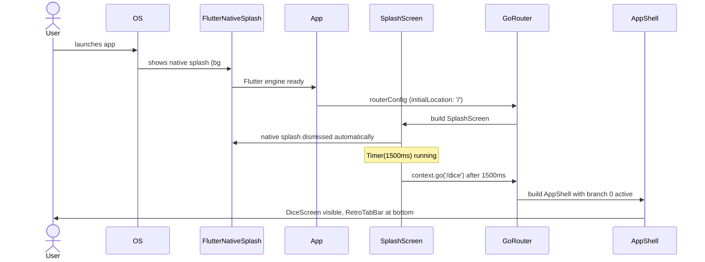

# feat: e09 app shell and splash — Standard

## Overview

Entrega o esqueleto navegável do app: substitui o `home: DiceScreen()` provisório em [lib/app.dart:92](../../lib/app.dart#L92) por um shell com 4 abas (`ROLAR / HISTÓRICO / JOGOS / AJUSTES`), precedido por um splash em dois estágios (nativo via `flutter_native_splash` + widget Flutter `SplashScreen` visível ~1.5s). Inclui stubs de 3 telas pendentes (`HistoryScreen`, `PresetsScreen`, `SettingsScreen`), uma `RetroTabBar` no design system shared, e wiring completo via `go_router` + `go_router_builder` + `StatefulShellRoute.indexedStack`.

Esta epic funde **EPIC 6 (Splash)** e **EPIC 7 (Navegação)** do `docs/plan/progress.md` em um único entregável, conforme o roadmap (`docs/roadmap/08-epics-m1.md:13`). O `progress.md` será atualizado na mesma PR (precedente: EPIC 4 / E10 já foi fundido).

O brainstorm [2026-05-26-e09-navegacao-brainstorm-doc.md](../brainstorm/2026-05-26-e09-navegacao-brainstorm-doc.md) capturou as decisões; este plano transforma em checklist file-by-file com cobertura 100%, fecha as 7 perguntas em aberto, e endereça os gaps identificados pelo `user-flow-analysis-agent` (lifecycle do timer, deep links, rebuild do `MaterialApp.router`, system back, Android 12 splash).

## Problem Statement / Motivation

Hoje o app sobe direto em `DiceScreen` — não há splash (o usuário vê o flash branco do native splash padrão antes de Flutter mountar), não há navegação entre features, e as 3 features pendentes (`history`, `presets`, `settings`) só existem como diretórios vazios. Sem E09:

- **E06/E07/E08 não conseguem entregar a UI delas** porque não há shell que hospede as telas. Cada uma teria que reinventar wiring de navegação.
- **A "porta de entrada" para o universo Call of Old Chico não existe.** A microcopy COCU no rodapé do splash é, junto com a descrição da loja, o único ponto de contato com o universo (ver `docs/roadmap/00-visao-geral.md:12`). Sem splash, fica sem.
- **O flash branco do native splash padrão quebra a estética 1-bit.** Splash nativo + splash Flutter em sequência elimina o gap visual no cold start ("liga e já está no universo do app").
- **O `home: DiceScreen()` provisório está marcado para remoção em E09** (ver `docs/plan/progress.md:33`).

A escolha por `go_router` + `StatefulShellRoute` é doutrinária pela memória de projeto `feedback_no_indexed_stack_use_go_router` (project memory): `IndexedStack` manual é proibido neste repositório. `StatefulShellRoute.indexedStack` é a API canônica do `go_router` para shells com bottom nav (per-branch Navigator, state preservation, deep linking) e funde a feature sem reinventar a roda.

A escolha por `go_router_builder` (codegen via `build_runner` já presente no projeto) garante rotas type-safe — erro de compilação em vez de runtime se um path muda.

## Proposed Solution

### Estrutura nova
```
lib/
├── app_router.dart                              # GoRouter config + StatefulShellRoute + redirect
├── app_router.g.dart                            # GERADO por go_router_builder (excluído de coverage)
├── core/
│   └── app_info.dart                            # const kAppVersion = 'v1.0' (única fonte)
├── features/
│   ├── shell/
│   │   └── app_shell.dart                       # builder do StatefulShellRoute, host do RetroTabBar
│   ├── splash/
│   │   └── splash_screen.dart                   # widget Flutter (1.5s, então context.go('/dice'))
│   ├── history/
│   │   └── history_screen.dart                  # stub "EM BREVE"
│   ├── presets/
│   │   └── presets_screen.dart                  # stub "EM BREVE"
│   └── settings/
│       └── settings_screen.dart                 # stub "EM BREVE"
└── shared/widgets/
    ├── retro_tab_bar.dart                       # bottom nav 1-bit custom
    └── pixel_icon.dart                          # CustomPaint que renderiza matriz 0/1 na paleta ativa

assets/icon/
└── icon.png                                     # placeholder 1024×1024 derivado do d6 pixel art

flutter_native_splash.yaml                       # NOVO (raiz do projeto)
```

### Arquivos modificados
- [lib/app.dart](../../lib/app.dart) — `App` vira `StatefulWidget` para owning do `GoRouter` (criação única); `_AppView` usa `MaterialApp.router(routerConfig: _router)`; `home:` removido. `MultiProvider` permanece acima — providers ficam visíveis a todas as rotas.
- [lib/main.dart](../../lib/main.dart) — sem mudanças funcionais; apenas garantir que `WidgetsFlutterBinding.ensureInitialized()` continua antes de tudo (requerido por `flutter_native_splash`).
- [pubspec.yaml](../../pubspec.yaml) — adiciona `go_router ^17.2.3` (dep), `go_router_builder ^4.3.0` (dev_dep), `flutter_native_splash ^2.4.7` (dev_dep). Adiciona `assets/icon/` aos assets.
- `lib/l10n/app_*.arb` (11 arquivos) — novas chaves: `appTagline`, `commonComingSoon`, `splashUniverseTagline`, `splashVersion`, `historyTitle`, `presetsTitle`, `settingsTitle`. **Reusa** `tabRoll`, `tabHistory`, `tabPresets`, `tabSettings` já existentes.
- `docs/plan/progress.md` — funde EPIC 6 + 7, marca tarefas concluídas.

### Arquivos de teste novos
```
test/
├── app_router_test.dart                              # config, rotas, redirect, NoTransitionPage
├── features/
│   ├── shell/
│   │   └── app_shell_test.dart                       # 4 tabs, troca, re-tap reset, state preservation
│   ├── splash/
│   │   └── splash_screen_test.dart                   # render, timer 1.5s → /dice, dispose cancela
│   ├── history/
│   │   └── history_screen_test.dart                  # render "EM BREVE" localizado
│   ├── presets/
│   │   └── presets_screen_test.dart                  # idem
│   └── settings/
│       └── settings_screen_test.dart                 # idem
└── shared/widgets/
    ├── retro_tab_bar_test.dart                       # 4 tabs render, active inversion, tap callback, a11y
    └── pixel_icon_test.dart                          # render matriz, troca de paleta, esp/dimensão
```

E [test/widget_test.dart](../../test/widget_test.dart) é atualizado para refletir `MaterialApp.router` e o fluxo splash → shell.

## Technical Considerations

### Arquitetura & dependências

- **`MultiProvider` no topo, `GoRouter` abaixo.** A árvore vira: `MultiProvider > _AppView (Stateful) > MaterialApp.router(routerConfig: _router)`. Providers ficam acima do `Router` então `context.read/watch` funciona dentro de qualquer rota. O `GoRouter` é criado uma vez no `initState` do `_AppView` (que vira `StatefulWidget`) — **isto é crítico**: criar dentro do `build` invalidaria a navegação a cada `notifyListeners` de `ThemeProvider`/`LocaleController`.

- **`go_router_builder` codegen.** Rotas definidas como classes anotadas (`@TypedGoRoute`, `@TypedStatefulShellRoute`) em `lib/app_router.dart`. `build_runner build --delete-conflicting-outputs` gera `lib/app_router.g.dart`. Type-safe: `const DiceRoute().go(context)` em vez de `context.go('/dice')`. Já temos `build_runner ^2.15.0` em dev_deps (de E04/hive), então é só adicionar `go_router_builder`.

- **Coverage de `*.g.dart`.** Já excluído globalmente em CI: [.github/workflows/ci.yml:43](../../.github/workflows/ci.yml#L43) tem `exclude: 'lib/main.dart **/*.g.dart lib/l10n/app_localizations*.dart'`. **Nada a mudar.** Confirmar local que `flutter test --coverage` continua a 100% após geração.

- **Two-stage splash.**
  - **Stage 1 (nativo).** `flutter_native_splash.yaml` configura ícone placeholder + bg branco. `dart run flutter_native_splash:create` injeta drawables/storyboard. Cobre o cold-start (~300–800ms iOS, variável Android).
  - **Stage 2 (Flutter widget).** `SplashScreen` é a tela em `/`. `initState` agenda `Timer(Duration(milliseconds: 1500))` que chama `if (!mounted) return; const DiceRoute().go(context);`. `dispose` cancela o timer. Constante extraída como `@visibleForTesting static const splashDuration = Duration(milliseconds: 1500)` para override em testes.

- **Paleta do splash: hard-coded Mac Classic (preto/branco).** O `SplashScreen` widget não lê `Theme.of(context).extension<OneBitColors>()` — usa `Color(0xFF000000)` e `Color(0xFFFFFFFF)` literais. Motivos: (a) na primeira execução não há paleta persistida; (b) consistência com o native splash (sempre branco); (c) MVP — paleta entra ao montar o shell. Documentado também como decisão fechada (resposta à pergunta aberta do brainstorm).

- **Ícones de tab via `CustomPaint` (`PixelIcon`).** Cada ícone é uma matriz `List<List<int>>` (0=transparente/paper, 1=ink) renderizada por um único `PixelIconPainter` reutilizável que lê `OneBitColors` do tema. Tab ativa: passa `inverted: true` para o `PixelIcon` (paper como ink) — combina com fundo invertido da aba ativa. Vantagem: paleta troca → repaint automático, sem reprocessar SVG/PNG. As 4 matrizes (d6, ampulheta, estrela, engrenagem) vão no próprio `retro_tab_bar.dart` como `static const`.

- **Branch transitions: `NoTransitionPage` em todas.** Estética 1-bit não casa com fade/slide; hard cut na troca de aba E na ida splash→shell. Cada `GoRoute` na shell usa `pageBuilder: (ctx, state) => NoTransitionPage(child: ...)`.

- **Deep links.** `go_router` lê o `initialRoute` do platform channel automaticamente. **Comportamento natural:** se o app é iniciado via deep link para `/history`, o `initialLocation` do platform sobrescreve `/` e o splash widget nunca monta — usuário vai direto para a aba alvo. Documentado nos testes. Sem `redirect` custom necessário.

- **Lifecycle do splash timer.** Decisão: **manter timer simples, sem pause/resume**. Se o app é backgrounded a t=0.5s e volta a t=10s, a navegação para `/dice` já aconteceu invisivelmente — usuário retorna na home. Edge case aceitável para MVP (raríssimo durante 1.5s) e evita complexidade de `WidgetsBindingObserver` na splash. O `mounted` check protege contra navegação em widget desmontado se hot-reload trocar a tela durante o timer.

- **System back no Android.** Comportamento default do `StatefulShellRoute` é o desejado: back na raiz da aba ativa sai do app (não troca de aba). Não há "back para a aba anterior" — alinhado com expectativa de bottom nav. Testar via `WidgetsBinding.handlePopRoute()` ou `tester.binding.handlePopRoute()`.

- **Re-tap de aba ativa reseta o stack daquela branch.** `RetroTabBar` chama `shell.goBranch(index, initialLocation: index == shell.currentIndex)`. Hoje, como cada branch tem só uma rota raiz, o efeito é invisível; quando E06/E07/E08 adicionarem sub-rotas dentro das branches, vai funcionar automaticamente.

### A11y

- Cada `_TabItem` no `RetroTabBar` é envolto em `Semantics(button: true, selected: isActive, label: l10n.tabXxx)`, com `excludeSemantics: true` no `PixelIcon` interno (icon é decorativo — label já é o ícone+texto combinados).
- `MergeSemantics` no item completo para que TalkBack/VoiceOver leia "ROLAR, botão, selecionado" em vez de fragmentos.
- Tamanho de tap target ≥ 44×44 (cada `_TabItem` ocupa 1/4 da largura × 60px de altura, o que satisfaz em qualquer dispositivo M1 alvo).

### i18n

ARB chaves novas (mínimas, em `lib/l10n/app_en.arb` template + 10 traduções):

| chave | EN | PT-BR | observação |
|---|---|---|---|
| `appTagline` | `Dice for every game` | `Dado para todo jogo` | splash, exibido em VT323 |
| `commonComingSoon` | `COMING SOON` | `EM BREVE` | usado nos 3 stubs |
| `splashUniverseTagline` | `part of the call of old chico universe` | `parte do universo call of old chico` | minúsculas, sem itálico textual — `TextStyle(fontStyle: FontStyle.italic)` aplicado no widget |
| `historyTitle` | `History` | `Histórico` | título do `AppBar` da stub |
| `presetsTitle` | `Games` | `Jogos` | idem |
| `settingsTitle` | `Settings` | `Ajustes` | idem |

**Não criar `splashVersion` como string ARB**: a versão `v1.0 · am2 studios` é renderizada concatenando `kAppVersion` (de `lib/core/app_info.dart`) com o literal `am2 studios` (nome próprio, não traduzir). Decisão YAGNI: se a versão virar dinâmica em E15, basta plugar `package_info_plus` num único lugar (`app_info.dart`).

**Reusar** `tabRoll`, `tabHistory`, `tabPresets`, `tabSettings` já existentes em todos os 11 ARBs ([lib/l10n/app_en.arb:9-12](../../lib/l10n/app_en.arb#L9-L12)). **Não criar** `nav_tab_*` redundantes.

### Performance

Splash adiciona ~1.5s ao tempo até a primeira interação. Tradeoff aceito para entregar a microcopy COCU e o "feel" retrô. Cold start total alvo: ~2s (native ~500ms + Flutter mount ~200ms + splash 1500ms − sobreposição). Sem regressão de performance fora do splash.

### Security

Nenhuma superfície de ataque introduzida (sem rede, sem deserialização externa, sem permissões adicionais).

## Acceptance Criteria

### Setup & dependências
- [ ] AC-1. `pubspec.yaml` adiciona `go_router: ^17.2.3` em `dependencies`, `go_router_builder: ^4.3.0` em `dev_dependencies`, `flutter_native_splash: ^2.4.7` em `dev_dependencies`. `assets/icon/` adicionado a `flutter.assets`.
- [ ] AC-2. `dart run build_runner build --delete-conflicting-outputs` gera `lib/app_router.g.dart` sem erros.
- [ ] AC-3. `flutter_native_splash.yaml` na raiz com bg branco `#FFFFFF`, ícone `assets/icon/icon.png`, e bloco `android_12.color: "#FFFFFF" + android_12.image: assets/icon/icon.png` (obrigatório para Android 12+).
- [ ] AC-4. `dart run flutter_native_splash:create` roda sem erro; arquivos nativos gerados são committed.
- [ ] AC-5. `assets/icon/icon.png` 1024×1024 placeholder commitado, derivado do d6 pixel art existente (gerado uma vez via script ou manualmente; E14 substitui).

### Router & navegação
- [ ] AC-6. `lib/app_router.dart` define um `GoRouter` com:
  - `initialLocation: '/'`
  - rota top-level `/` → `SplashScreen` (com `NoTransitionPage`)
  - `StatefulShellRoute.indexedStack` com 4 branches: `/dice`, `/history`, `/presets`, `/settings` (cada uma com `NoTransitionPage`)
  - `routerConfig` exportado para uso em `MaterialApp.router`
- [ ] AC-7. Rotas declaradas como classes anotadas (`@TypedGoRoute`, `@TypedStatefulShellRoute`) compatíveis com `go_router_builder`.
- [ ] AC-8. `lib/app.dart` `_AppView` vira `StatefulWidget`; cria o `GoRouter` uma única vez em `initState`; substitui `MaterialApp(home: DiceScreen())` por `MaterialApp.router(routerConfig: _router, ...)` — restante das props (`title`, `theme`, `locale`, `supportedLocales`, `localizationsDelegates`, `localeResolutionCallback`) preservadas.

### Splash
- [ ] AC-9. `lib/features/splash/splash_screen.dart`: `StatefulWidget` que renderiza, em ordem vertical: mac titlebar listrada com "1-BIT DICE", wordmark "1-BIT\nDICE" (PressStart2P 56), `PixelDivider`, tagline (`appTagline` em VT323 22), d6 pixel art 144×144 (via `PixelIcon` reutilizando uma matriz do design system), e rodapé com `kAppVersion · am2 studios` (PressStart2P 8) + `splashUniverseTagline` (PressStart2P 6, italic, cinza).
- [ ] AC-10. Cores fixas: bg `Color(0xFFFFFFFF)`, fg `Color(0xFF000000)` — splash NÃO lê `OneBitColors`.
- [ ] AC-11. `initState` agenda `Timer(SplashScreen.splashDuration, _navigate)` onde `_navigate` faz `if (!mounted) return; const DiceRoute().go(context);`. `dispose` cancela o timer.
- [ ] AC-12. `SplashScreen.splashDuration` é `@visibleForTesting static const Duration(milliseconds: 1500)`.

### App shell
- [ ] AC-13. `lib/features/shell/app_shell.dart`: `AppShell extends StatelessWidget` que recebe `StatefulNavigationShell shell` e renderiza `Scaffold(body: shell, bottomNavigationBar: RetroTabBar(shell: shell))`.
- [ ] AC-14. `lib/shared/widgets/retro_tab_bar.dart`: `RetroTabBar extends StatelessWidget`, 60px de altura, borda superior 2px ink, 4 `_TabItem` igualmente distribuídos. Tab ativa fica com bg `ink` e fg `paper` (inversão). Tap em tab j chama `shell.goBranch(j, initialLocation: j == shell.currentIndex)`.
- [ ] AC-15. `_TabItem` envolve label+icon em `MergeSemantics(child: Semantics(button: true, selected: isActive, label: l10n.tabXxx, child: ...))`. `PixelIcon` interno usa `excludeSemantics: true`.
- [ ] AC-16. Ícones inline como `static const List<List<int>>` no arquivo: `_iconDice` (matriz 12×12 d6), `_iconHourglass`, `_iconStar`, `_iconGear` — convertidos das matrizes SVG em [docs/prototypes/03-splash-home.html:608-665](../../docs/prototypes/03-splash-home.html#L608-L665).

### Pixel icon shared
- [ ] AC-17. `lib/shared/widgets/pixel_icon.dart`: `PixelIcon` recebe `matrix: List<List<int>>`, `size: double` (default 24), `inverted: bool` (default false). Usa `CustomPaint` com `PixelIconPainter` que lê `OneBitColors.ink/paper` do tema; `inverted` troca os papéis.
- [ ] AC-18. Painter `shouldRepaint` retorna `true` quando `matrix`, `ink` ou `paper` mudam (para responder a troca de paleta).

### Stubs por feature
- [ ] AC-19. `lib/features/history/history_screen.dart`: `Scaffold(appBar: AppBar(title: Text(l10n.historyTitle)), body: Center(Text(l10n.commonComingSoon)))`.
- [ ] AC-20. `lib/features/presets/presets_screen.dart`: idem com `l10n.presetsTitle`.
- [ ] AC-21. `lib/features/settings/settings_screen.dart`: idem com `l10n.settingsTitle`.
- [ ] AC-22. Cada stub usa o `Theme.of(context).extension<OneBitColors>()` para bg/fg (paper/ink), consistente com `DiceScreen`.

### Home (`DiceScreen`)
- [ ] AC-23. Atualizar `dice_screen.dart` para remover assumptions de "tela única" se houver (ex: padding extra que assumia barra de status visível). A `dice_screen` permanece como está visualmente; só passa a viver dentro do shell.
- [ ] AC-24. **NÃO adicionar** botão de engrenagem no AppBar da home (decisão fechada: redundante com a aba AJUSTES).

### App info
- [ ] AC-25. `lib/core/app_info.dart` exporta `const String kAppVersion = 'v1.0';`. Documentado: trocar para `package_info_plus` em E15 se necessário.

### i18n
- [ ] AC-26. `lib/l10n/app_en.arb` (template) e 10 demais ARBs (`pt`, `pt_BR`, `es`, `fr`, `de`, `it`, `ja`, `ko`, `ru`, `zh`, `zh_Hans`) recebem: `appTagline`, `commonComingSoon`, `splashUniverseTagline`, `historyTitle`, `presetsTitle`, `settingsTitle`. Em todos os 11 ARBs.
- [ ] AC-27. `flutter gen-l10n` (ou rebuild) regenera `lib/l10n/app_localizations*.dart` para refletir as novas chaves; novas chaves disponíveis via `context.l10n.appTagline` etc.

### Testes (100% coverage obrigatório)
- [ ] AC-28. `test/app_router_test.dart`:
  - rota `/` resolve para `SplashScreen`
  - rota `/dice` resolve para `DiceScreen` dentro do `AppShell`
  - rotas `/history`, `/presets`, `/settings` resolvem para os stubs corretos
  - `routerConfig` é um `GoRouter` e tem `initialLocation == '/'`
  - branches do `StatefulShellRoute` são 4 e mapeiam para os paths corretos
- [ ] AC-29. `test/features/splash/splash_screen_test.dart`:
  - renderiza wordmark `1-BIT\nDICE`, tagline localizada, d6 pixel art, version line, microcopy COCU
  - usa cores hard-coded (`#000000` / `#FFFFFF`) — assert via inspeção de pixel ou propriedades de `Container`/`Text`
  - microcopy COCU tem `fontStyle: FontStyle.italic`
  - após `tester.pump(SplashScreen.splashDuration + 100ms)`, navega para `/dice` (assert: encontra `DiceScreen`)
  - se a tela for trocada antes do timer disparar (simular via `tester.pumpWidget(otherApp)`), timer cancela e não dispara navegação (sem exceções)
- [ ] AC-30. `test/features/shell/app_shell_test.dart`:
  - renderiza `RetroTabBar` com 4 tabs
  - tap em cada tab muda `shell.currentIndex` e renderiza o conteúdo correto
  - re-tap na tab ativa não quebra (e quando E06 adicionar sub-rotas, vai resetar — testar via stub navegação se possível)
  - `DiceController` state (ex: `count` setado em 5) sobrevive a ir para `/history` e voltar para `/dice`
  - back-button do Android na raiz de `/dice` propaga (sai do app) — testar com `tester.binding.handlePopRoute()`
- [ ] AC-31. `test/shared/widgets/retro_tab_bar_test.dart`:
  - renderiza 4 ícones (`PixelIcon`) + 4 labels (`tabRoll`/`tabHistory`/`tabPresets`/`tabSettings`)
  - tab ativa tem bg ink e fg paper (inversão); inativas têm bg paper e fg ink
  - tap em cada item dispara `shell.goBranch` com índice correto e `initialLocation` correto
  - cada item tem `Semantics(button: true, selected: isActive, label: ...)`
- [ ] AC-32. `test/shared/widgets/pixel_icon_test.dart`:
  - renderiza matriz dada nas cores `ink`/`paper` do tema ativo
  - troca de paleta dispara repaint (`shouldRepaint == true`)
  - `inverted: true` inverte os papéis
  - tamanho do CustomPaint respeita `size`
- [ ] AC-33. `test/features/history/history_screen_test.dart` (idem `presets`, `settings`):
  - renderiza `AppBar` com título localizado
  - renderiza `Center(Text)` com `commonComingSoon` localizado
- [ ] AC-34. `test/widget_test.dart` atualizado:
  - `App` usa `MaterialApp.router` (assert via `find.byType(MaterialApp)` + leitura de `routerConfig`)
  - splash aparece primeiro; após `splashDuration`, `DiceScreen` aparece
  - mudança de paleta via `ThemeProvider` continua re-pintando o tema (test existente preservado mas adaptado para esperar `pumpAndSettle` após o splash)
  - i18n: `supportedLocales.length == 10`, delegate registrado — testes existentes preservados
- [ ] AC-35. `flutter test --coverage` passa com 100% line coverage (validado por `very_good_coverage` com exclude já configurado).

### `progress.md` & docs
- [ ] AC-36. `docs/plan/progress.md` funde EPIC 6 e EPIC 7 em uma seção única "EPIC 6/7 — Navegação (Splash + App Shell)" (precedente: EPIC 4/E10). Todas as tarefas marcadas como concluídas com link para esta plan.
- [ ] AC-37. Brainstorm doc movido/permanece em `docs/brainstorm/` (não deletar — é o registro histórico).

### Quality gates
- [ ] AC-38. `flutter analyze` exit code 0, zero issues (`very_good_analysis ^7.0.0`).
- [ ] AC-39. `flutter test --coverage` exit code 0, 100% line coverage no projeto.
- [ ] AC-40. `flutter build apk --release` e `flutter build ios --release --no-codesign` rodam sem erros (validação que `flutter_native_splash:create` injetou tudo corretamente).

## Success Metrics

- Usuário liga o app e vê: native splash branco → splash Flutter (1.5s) → home (`DiceScreen`) com bottom nav visível. Zero flash branco entre as transições.
- Toca em qualquer tab inferior, a tela troca instantaneamente (hard cut, sem animação).
- Volta para ROLAR e o resultado da última rolagem (se houver) ainda está em tela — estado preservado.
- Microcopy COCU é legível no rodapé do splash (mesmo que pequena), em itálico.
- Trocar idioma em runtime (via `LocaleController`, quando E13 expor UI em ajustes) atualiza labels das tabs e título dos stubs sem reset de navegação.
- Trocar paleta atualiza cores dos ícones de tab e do bg sem reset de navegação.
- CI verde (analyze + test + build + coverage).

## Dependencies & Risks

### Dependências
- **Já cumpridas:** E01 (setup), E02 (design system: `PixelDivider`, `OneBitColors`, tipografia), E04 (build_runner já em dev_deps), E13 (i18n completa, 11 ARBs).
- **Não bloqueante:** E14 (assets reais) — usamos placeholder PNG aqui; E14 só troca o arquivo.

### Riscos & mitigações

- **R1 — `MaterialApp.router` rebuild loop.** Se o `GoRouter` for criado dentro do `build` de `_AppView`, cada `notifyListeners` de `ThemeProvider` ou `LocaleController` recria o router e zera a navegação. **Mitigação:** `_AppView` vira `StatefulWidget`, `_router` é campo final inicializado em `initState`. AC-8 enforça. Test cobre que tabs sobrevivem a `provider.setPalette`.

- **R2 — Lifecycle do timer no splash.** Background mid-splash poderia causar `context.go` em widget desmontado, levando a exceção. **Mitigação:** `if (!mounted) return;` antes de navegar; timer cancelado em `dispose`. AC-11 e AC-29 enforçam.

- **R3 — `flutter_native_splash:create` quebra em CI.** A ferramenta às vezes falha silenciosamente em PNGs malformados ou em path errado. **Mitigação:** rodar localmente uma vez, **committar os arquivos gerados nativos** (assim como `*.g.dart` do hive), e não rodar a ferramenta em CI. CI valida via `flutter build` (AC-40).

- **R4 — Coverage do `app_router.g.dart`.** Arquivo gerado pode adicionar linhas não-cobertas. **Mitigação:** `**/*.g.dart` já está no exclude do `very_good_coverage` ([.github/workflows/ci.yml:43](../../.github/workflows/ci.yml#L43)). Confirmar local que `flutter test --coverage --coverage-path=...` não inclui esse arquivo no relatório agregado.

- **R5 — Android 12 splash quebrado sem bloco `android_12`.** Sem o bloco específico, o splash fica letterboxed/cortado em devices Android 12+. **Mitigação:** AC-3 obriga o bloco. Validar visualmente em um device/emulador Android 12+.

- **R6 — Deep link sobrescrevendo splash.** Decisão consciente: deep link pula splash. Pode surpreender QA. **Mitigação:** documentar no PR e adicionar um TODO se quisermos forçar splash em todos os entrypoints — para M1 é o comportamento desejado.

- **R7 — Tradução de strings novas.** As 6 chaves novas precisam ir em 11 ARBs. Risco de digitar errado e quebrar `flutter gen-l10n`. **Mitigação:** AC-26 lista todos os arquivos; rodar `flutter gen-l10n` localmente e verificar ausência de warnings.

- **R8 — Sobreposição com o trabalho da home (`DiceScreen`).** Mover a home para dentro do shell pode alterar dimensões disponíveis (perde altura para a tab bar). **Mitigação:** `DiceScreen` já usa `SafeArea` + `LayoutBuilder` + `SingleChildScrollView` ([lib/features/dice/dice_screen.dart:25-72](../../lib/features/dice/dice_screen.dart#L25-L72)), então é responsivo. Validar visualmente em dispositivos pequenos.

## ERD / Diagramas

```mermaid
graph TD
    A[main.dart] --> B[App<br/>MultiProvider]
    B --> C[_AppView<br/>StatefulWidget]
    C --> D[MaterialApp.router]
    D --> E[GoRouter<br/>app_router.dart]
    E -->|/ initialLocation| F[SplashScreen<br/>Timer 1500ms]
    E -->|StatefulShellRoute| G[AppShell<br/>Scaffold + RetroTabBar]
    F -.context.go.->|/dice| G
    G -->|/dice| H[DiceScreen]
    G -->|/history| I[HistoryScreen stub]
    G -->|/presets| J[PresetsScreen stub]
    G -->|/settings| K[SettingsScreen stub]
    G --> L[RetroTabBar]
    L --> M[PixelIcon x4]
    M -.reads.-> N[OneBitColors<br/>ThemeExtension]
```



## References & Research

### Brainstorm & roadmap
- Brainstorm: [docs/brainstorm/2026-05-26-e09-navegacao-brainstorm-doc.md](../brainstorm/2026-05-26-e09-navegacao-brainstorm-doc.md)
- Epic list: [docs/roadmap/08-epics-m1.md:13](../roadmap/08-epics-m1.md#L13)
- Escopo M1 (Splash→Home): [docs/roadmap/01-escopo-m1.md:77](../roadmap/01-escopo-m1.md#L77)
- Identidade visual & cor: [docs/roadmap/02-identidade-visual.md](../roadmap/02-identidade-visual.md)
- Conceito COCU: [docs/roadmap/00-visao-geral.md:12](../roadmap/00-visao-geral.md#L12)
- Stack técnico: [docs/roadmap/03-stack-tecnico.md:73](../roadmap/03-stack-tecnico.md#L73)
- Protótipo HTML: [docs/prototypes/03-splash-home.html](../prototypes/03-splash-home.html)

### Repositório
- Arquivo a substituir: [lib/app.dart:92](../../lib/app.dart#L92)
- Entry point: [lib/main.dart](../../lib/main.dart)
- Padrão `OneBitColors` ThemeExtension: [lib/core/theme/app_theme.dart:12](../../lib/core/theme/app_theme.dart#L12)
- Padrão shared widget com `OneBitColors`: [lib/shared/widgets/pixel_divider.dart](../../lib/shared/widgets/pixel_divider.dart)
- Padrão l10n extension: [lib/core/i18n/l10n_extension.dart](../../lib/core/i18n/l10n_extension.dart)
- Padrão `ChangeNotifier` provider raiz: [lib/core/theme/theme_provider.dart](../../lib/core/theme/theme_provider.dart)
- ARB template: [lib/l10n/app_en.arb](../../lib/l10n/app_en.arb)
- Plano existente referência (formato e tom): [docs/plan/2026-05-26-feat-e10-audio-haptic-plan.md](2026-05-26-feat-e10-audio-haptic-plan.md)
- CI coverage exclude: [.github/workflows/ci.yml:43](../../.github/workflows/ci.yml#L43)

### Memórias de projeto
- `feedback_no_indexed_stack_use_go_router` (project memory) — **regra dura**: este projeto usa `go_router` + `StatefulShellRoute`, NÃO `IndexedStack`.
- `feedback_no_underscore_prefixed_folders` (project memory) — não inventar `_internal`/`_dev`.

### Pacotes externos
- [go_router ^17.2.3](https://pub.dev/packages/go_router) — declarative router, deep linking, `StatefulShellRoute.indexedStack`.
- [go_router_builder ^4.3.0](https://pub.dev/packages/go_router_builder) — codegen para rotas type-safe.
- [flutter_native_splash ^2.4.7](https://pub.dev/packages/flutter_native_splash) — splash nativo iOS/Android com suporte a Android 12+.

### Convenções
- `CLAUDE.md` — palette rule (2 cores apenas), state mgmt (sem Bloc/Riverpod), 100% coverage, `*.g.dart` excluído.
